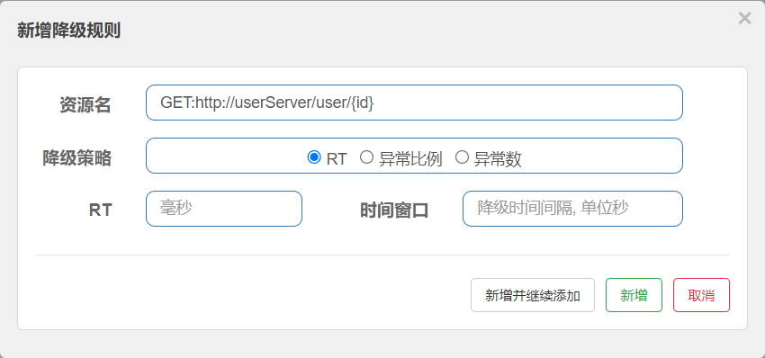

# 工程简介
> 
- sentinel的使用
  - 导入依赖
  - 添加配置
  - 启动sentinel.jar,运行控制台
- sentinel的流控
  - 直接模式
    - 直接的控制每一个控制的QPS值来实现对流量的控制
  - 关联模式
    - 使用场景为有两个竞争关系的控制器之间
    - 列入update和query有竞争关系，update业务需求的竞争力要大于query，这时候我们在query中添加限流规则为关联模式，
      当关联的资源访问量大了query就会主动的拒绝服务
  - 链路模式
    - 当一个控制器调用同一个server层业务的时候，我们可以对server层使用链路模式来控制这两个控制器的QPS
    - 首先在server层使用@SentinelResource（”ResourceName“）
    - 在sentinel控制台对ResourceName添加流控规则
    
  - 热点流控规则
    - 首先sentinel不会对controller层的接口进行热点限流，只对@SentinelResource注解的资源进行热点控流，
      所以想要实现控制器的资源控流还需要在控制器上加上对应的注解
    - 之后在sentinel控制台上的热点流控规制。表单中添加对应的参数
    
>    
- sentinel的降级服务
  - 首先我们服务的远程调用使用feign实现调用的所有需要线起开feign对sentinel的支持，在配置文件中 开始
  - 其次就是我们有两种方式来实现我的熔断降级之后的服务
    - fallBackClass
    - fallBackFactory 推荐使用这个可以对异常进行出来
      - 实现fallBackFactory接口指定我们的UserClients接口为泛型
      - 书写降至之后的业务逻辑
  - sentinel控制台中也可以配置熔断规则来实现触发我们的降级业务
    - 指定的响应时间
    - 指定的异常数
    - 指定的异常比例
      
>
- sentinel授权规则
  - 首先需要在合法的请求来源的头部添加好我们预先规定的约定，比如我们这里就是在gateway中的配置好请求头参数为
    origin=fromGateway，
  - 之后我们在服务的被调用者的模块中书写实现RequestOriginParser的类，他个类的目的就是获取请求来源的请求头参数origin的值然后返回给
    sentinel
  - 在sentinel控制台页面对指定的资源添加授权规则，在规则的应用流中填写fromGateway，当请求访问对应的资源的时候后台会自动的校验，
    参数值一致就放行不一致则会拦截
  - 测试就是一个通过gateway访问呢OrderServer，一个直接访问OrderServer，gateway会成功，直接访问则会被拦截