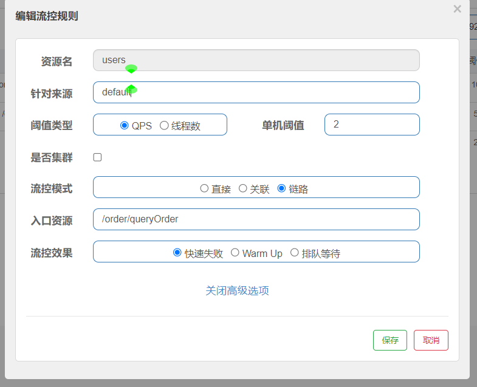
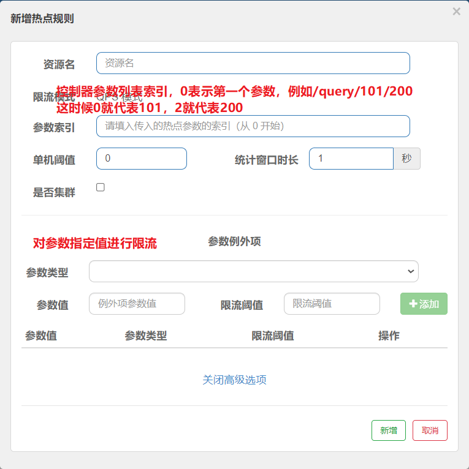

# 工程简介
- sentinel的使用
  - 导入依赖
  - 添加配置
  - 启动sentinel.jar,运行控制台
- sentinel的流控
  - 直接模式
    - 直接的控制每一个控制的QPS值来实现对流量的控制
  - 关联模式
    - 使用场景为有两个竞争关系的控制器之间
    - 列入update和query有竞争关系，update业务需求的竞争力要大于query，这时候我们在query中添加限流规则为关联模式，
      当关联的资源访问量大了query就会主动的拒绝服务
  - 链路模式
    - 当一个控制器调用同一个server层业务的时候，我们可以对server层使用链路模式来控制这两个控制器的QPS
    - 首先在server层使用@SentinelResource（”ResourceName“）
    - 在sentinel控制台对ResourceName添加流控规则
    
  - 热点流控规则
    - 首先sentinel不会对controller层的接口进行热点限流，只对@SentinelResource注解的资源进行热点控流，
      所以想要实现控制器的资源控流还需要在控制器上加上对应的注解
    - 之后在sentinel控制台上的热点流控规制。表单中添加对应的参数
    